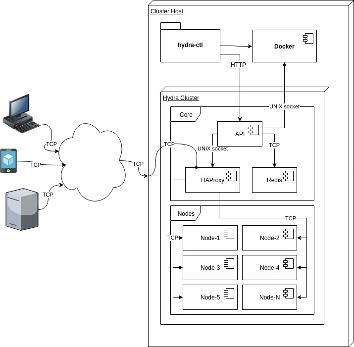

# Hydra

Hydra is a Docker container orchestration solution (PoC) on a single host. Whole Hydra cluster runs on Docker containers.
Services are deployed on cluster nodes into Docker containers (Docker in Docker).

Cluster has following components
* management node (Flask in Docker container)
* data node (Redis in Docker container)
* proxy node (HAProxy in Docker container)
* nodes (Docker containers)
* services (Docker in Docker containers on nodes)

Cluster management (create cluster, destroy cluster, add node, add service) is done through command line utility *hydra-ctl*. Deployed 
services are available through proxy node.

All the cluster nodes are connected through dedicated cluster network (docker network).

## Architecture

### Quick overview

.

* **hydra-ctl** - tool to manage Hydra cluster (interfaces with API and Docker engine)
* **Docker** - Docker engine on host
* **Hydra Cluster** - collection of processes (Docker containers) which make up Hydra cluster
    * **Core** - collection of processes which drive cluster work
        * **API** - cluster management (adding nodes and services, migrating services, reporting state) 
        * **HAProxy** - cluster entrypoint to clients. It proxies requests toward servcies which are deployed on cluster
        * **Redis** - storage to store configuration of services
    * **Nodes** - Docker containers acting as cluster nodes where services can de deployed
        * **Node-N** - single node which can host multiple services

### hydra-ctl

hydra-ctl is the control utility of Hydra cluster. It can be used to initialize cluster core nodes and to add new service nodes
and services in cluster.

Start Hydra cluster name *test* with API port set to 4000 (API will be available on http://localhost:4000. `cluster start` merely
starts cluster's core nodes. Service nodes need to be added separately. 

    hydra-ctl cluster start test --port 4000

Add service nodes to cluster. Every execution of `node add` adds exactly one service node to the cluster.

    hydra-ctl node add --cluster test

Deploy services on service nodes in the cluster.

    hydra-ctl service add hello1 --image 'crccheck/hello-world' --cluster test --replicas 3 --node-port 8001 --service-port 8000

Destroy cluster *test*.

    hydra-ctl cluster destroy test
    

### API

Exposes following endpoints

* /node POST - adding new node in cluster (used by `hydra-ctl node add`)
* /service POST - deploying new service on services nodes (used by `hydra-ctl service add`)
* /state GET - returns cluster state in JSON format

While adding service nodes, API starts a monitor on every service node. These monitors react on node down events.
Node down events cause Hydra API to migrate services from failed node to available nodes.

While deploying services on cluster, API stores service configuration in Redis. API also registers deployed
services in HAProxy to make them available for clients.

### HAProxy

Cluster entrypoint for outside world and service load balancer (round robin). Before adding new services make sure
proxy is supporting your service backends. Configuring new backends in HAProxy is currently manual but can be easily
made dynamic (requires a bit of development).

### Redis

Storage to keep track of service configuration. Used by API /state GET and service migration process.

### Node-N

Host for deployed services. Service ports are exposed on host level inside dedicated cluster network.
Hydra service nodes are configured as backend nodes in HAProxy under dedicated backend for the service.

## Things to be done

* Automated functional testing
* More unit testing
* Error handling
* Cluster resiliency
* Product packaging
* Additions to cluster management API
* Dynamic management of HAProxy backends
* Security
* Various TODO items in code

# Setup of test cluster

## Install Docker on Ubuntu 18.04 LTS

As described at https://docs.docker.com/install/linux/docker-ce/ubuntu/.

    sudo apt-get udpate
    sudo apt-get install -y apt-transport-https ca-certificates curl gnupg-agent software-properties-common
    curl -fsSL https://download.docker.com/linux/ubuntu/gpg | sudo apt-key add -
    sudo add-apt-repository "deb [arch=amd64] https://download.docker.com/linux/ubuntu $(lsb_release -cs) stable"
    sudo apt-get update
    sudo apt-get install -y docker-ce docker-ce-cli containerd.io

### Test Docker Installation

    sudo docker run hello-world

## Put your user into docker group

    sudo usermod -G docker -a $USER

**Log out and log in**

## Install Hydra dependencies on Ubuntu

    sudo apt-get install -y unzip python3-venv make

## Create test cluster

Run commands in this section and its subsections as the user which was put into **docker group**.

If you have access to Hydra repo then run following

    git clone https://github.com/ragnarpa/hydra.git

If you have Hydra sources packed into an archive then use necessary tools to unpack the archive into directory *hydra*.
Example is given for Zip archive.

    unzip Hydra.zip -d hydra

Create virtual environment for Python.

    cd hydra && python3 -m venv venv
    . venv/bin/activate

Run Python tests (unit tests).

    make test
    
Prepare Docker images and *hydra-ctl*

    make all

Create test cluster.

    make create-test-cluster

Creating Python's virtual environment here is actually optional but creating it for PoC-s and testing is a good practice
not to mess up your system wide Python site packages. After `make create-test-cluster` completes you should have test cluster with 5 nodes up and running.

### Deploy a service on test cluster

    hydra-ctl service add hello1 --image 'crccheck/hello-world' --cluster test --replicas 3 --node-port 8001 --service-port 8000

#### Use deployed service

Navigate to *http://\<fqdn\>:8888/hello1* in your web browser. Replace *\<fqdn\>* with server DNS address. Please note 
that port 8888 on cluster's host has to be accessible from the client network if connecting remotely. 
You may need to configure ACL-s of cluster's host network respectively.

#### See how proxy and load balancer works

Navigate to *http://\<fqdn\>:9999/stats* in your web browser (user:stats, password: stats). Replace *\<fqdn\>* with server DNS address. 
Please note that port 9999 on cluster's host has to be accessible from the client network if connecting remotely. 
You may need to configure ACL-s of cluster's host network respectively.

#### Query cluster state on command line on cluster host

    curl http://0.0.0.0:4000/state

Since cluster's API is local to the cluster host then */state* is accessible only from cluster host.

### Inspecting nodes

As every node (including management and proxy) is actually a Docker container you can inspect and play with nodes via
different docker commands like *docker ps, docker exec ..., docker stop ..., docker container inspect ...* and so on.

### Destroy test cluster

Given that you still have cluster's host console open and Python's virtual env activated run following command

    hydra-ctl cluster destroy test

## Development environment

Hydra was developed and built using following components, tools and frameworks
* OS - Ubuntu 18.4 LTS
* Docker 1.5
* Docker images
    * [docker:latest](https://hub.docker.com/_/docker)
    * [docker:dind](https://hub.docker.com/_/docker)
    * HAProxy ([haproxy:latest](https://hub.docker.com/_/haproxy))
    * Redis ([redis:latest](https://hub.docker.com/_/redis))
* Python 3.6.6
    * [docker 3.7.2](https://pypi.org/project/docker/3.7.2/)
    * [redis 3.2.1](https://pypi.org/project/redis/3.2.1/)
    * [Flask 1.0.2](https://pypi.org/project/Flask/1.0.2/)
    * [requests 2.21.0](https://pypi.org/project/requests/2.21.0/)
    * [pytest 4.4.0](https://pypi.org/project/pytest/4.4.0/)
    * [pytest-mock 1.10.3](https://pypi.org/project/pytest-mock/1.10.3/)
